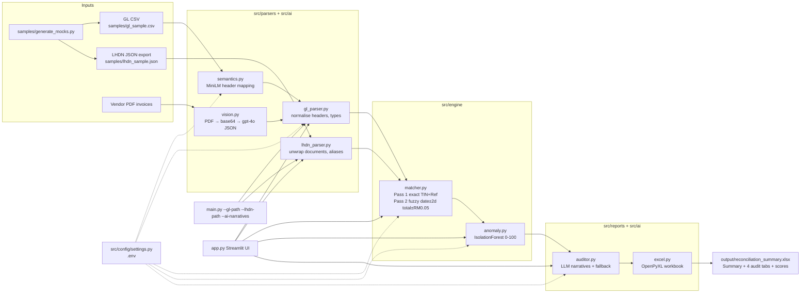

# LHDN MyInvois vs General Ledger — Financial Reconciliation Engine

Standalone, production-ready Python project that reconciles **General Ledger (GL) sales**
against **LHDN MyInvois submissions** and produces a formatted, multi-tab Excel audit workbook.

## Architecture



## Matching rules

| Stage | Rule | Outcome |
|---|---|---|
| 1 — Exact | Same TIN **and** same invoice reference (case/whitespace normalised) | Totals + SST within tolerance → `Matched`, else → `SST_Rate_Mismatch` |
| 2 — Fuzzy | Same TIN **and** date within ±2 days **and** total within ±RM 0.05 | Same ref + SST ok → `Matched`; SST off → `SST_Rate_Mismatch`; different ref → `Missing_UUID` |
| Leftovers | No counterpart at either stage | GL-only → `Unsubmitted_Sales`; LHDN-only → `Missing_UUID` |

Tolerances are configurable (`--date-tolerance`, `--amount-tolerance`, `--sst-tolerance`,
defaults 2 / 0.05 / 0.05) and also loadable from `.env`.

## Project layout

```
├── main.py                  # CLI entry point (argparse, --ai-narratives)
├── app.py                   # Streamlit UI (upload → reconcile → download)
├── src/
│   ├── config/settings.py   # env-driven Settings (python-dotenv)
│   ├── parsers/             # gl_parser.py (+AI auto-mapping), lhdn_parser.py
│   ├── ai/                  # semantics.py, vision.py, auditor.py
│   ├── engine/              # matcher.py (2-pass core), reconciler.py (façade),
│   │                        # anomaly.py (IsolationForest scoring)
│   └── reports/             # excel.py (workbook), tables.py (UI formatting)
├── samples/                 # synthetic GL CSV + LHDN JSON (12 x 10 records)
├── tests/                   # pytest suite (20 tests)
├── output/                  # generated reconciliation_summary.xlsx
├── Dockerfile
├── docker-compose.yml
├── requirements.txt
├── pytest.ini
└── .env.example
```

## Quickstart

### Option A — web UI (recommended for interactive use)

```powershell
pip install -r requirements.txt
copy .env.example .env
streamlit run app.py
```

Then open http://localhost:8501 — tick **Use bundled sample files**, press
**Run reconciliation**, inspect the four audit tabs, and download the workbook.

### Option B — virtualenv CLI (Windows PowerShell)

```powershell
python -m venv .venv; .\.venv\Scripts\Activate.ps1
pip install -r requirements.txt
copy .env.example .env
python -m pytest tests/ -v
python main.py --gl-path samples\gl_sample.csv --lhdn-path samples\lhdn_sample.json --output output\reconciliation_summary.xlsx
```

### Option C — virtualenv CLI (macOS / Linux)

```bash
python3 -m venv .venv && source .venv/bin/activate
pip install -r requirements.txt
cp .env.example .env
python -m pytest tests/ -v
python main.py --gl-path samples/gl_sample.csv --lhdn-path samples/lhdn_sample.json --output output/reconciliation_summary.xlsx
```

### Option D — Docker

```bash
cp .env.example .env
docker compose up --build reconciler   # CLI run, workbook -> output/
docker compose up --build ui           # web UI on http://localhost:8501
docker compose up --build api          # REST API on http://localhost:8000
```

## API service (FastAPI, :8000)

```bash
uvicorn src.api.app:app --reload --port 8000
# interactive docs: http://localhost:8000/docs
```

```bash
# Health
curl http://localhost:8000/health

# Reconcile (multipart upload; tolerances + ai_narratives optional)
curl -X POST http://localhost:8000/api/v1/reconcile \
  -F gl_file=@samples/gl_sample.csv \
  -F lhdn_file=@samples/lhdn_sample.json \
  -F date_tolerance=2 -F amount_tolerance=0.05 -F sst_tolerance=0.05

# Fetch run detail + workbook (run_id from the POST response)
curl http://localhost:8000/api/v1/runs/<run_id>
curl -OJ http://localhost:8000/api/v1/runs/<run_id>/workbook
```

Notes: `ai_narratives=true` uses the configured LLM key, off by default.

## Production operations (auth, persistence, audit, deploy)

**Auth + multi-tenancy.** Every `/api/v1` route needs `X-API-Key`.
Keys are per-company tenants, SHA-256 hashed at rest; runs are strictly
isolated (a tenant that guesses another run_id gets 404). Bootstrap:

```bash
# .env
TENANT_SEED=acme:lhdn_paste-a-long-random-key
ADMIN_KEY=another-long-random-secret   # enables POST /api/v1/admin/tenants
```

```bash
curl -X POST http://localhost:8000/api/v1/admin/tenants \
  -H "X-API-Key: <seed-key>" -H "X-Admin-Key: <admin-key>" \
  -H "Content-Type: application/json" -d '{"name":"new-co"}'
# -> {"tenant_id": "...", "api_key": "..."}  (raw key shows ONCE)
```

**Persistence.** `DATABASE_URL` selects SQLite (`./data/app.db`, default)
or Postgres (`postgresql+psycopg://...`). Same `RunRepository` seam either
way. Compose ships Postgres with a health-gated API:

```bash
docker compose up --build db api
```

**Audit trail.** Every run logs `run_completed`; every workbook fetch logs
`workbook_downloaded`. Read them per run:

```bash
curl -H "X-API-Key: <key>" http://localhost:8000/api/v1/runs/<run_id>/events
```

**Reliability.** Request IDs (`X-Request-ID` echoed + in logs), 120
req/min per-key rate limiting (429 + JSON body), 25 MiB upload cap,
traceback-free 500s, CORS scoped to the UI origin.

**Backups.** Postgres volume is `dbdata`; snapshot with
`docker compose exec db pg_dump -U recon reconciler > backup.sql`.

**Website.** The API serves a static landing page at `/`
(`src/api/static/index.html`) linking the docs and the Streamlit app.

## UI walkthrough (`streamlit run app.py`)

Four pages, one workflow (all through the API — start it first,
paste a tenant key in the sidebar; UI runs inherit tenant isolation,
audit and rate limits):

1. **🧾 Upload & Run** — inputs, tolerances, AI-narrative toggle, Run.
   Results land in session state for the other pages.
2. **📊 Dashboard** — KPI metrics, bucket-mix donut, SST-variance bars,
   anomaly-score histogram (plotly).
3. **📥 Exceptions inbox** — every non-matched row with filters, reviewer
   notes and Mark reviewed/Reopen. Progress bar; decisions persist to
   `output/reviews.json`.
4. **📤 Exports** — Excel workbook, exceptions-with-reviews CSV, review
   log JSON.

## CLI usage

```bash
python main.py --help
python main.py --gl-path samples/gl_sample.csv --lhdn-path samples/lhdn_sample.json
python main.py --gl-path ./my_gl.csv --lhdn-path ./my_lhdn.json --output output/audit.xlsx --date-tolerance 2 --amount-tolerance 0.05 --sst-tolerance 0.05
```

| Argument | Default (from `.env`) | Description |
|---|---|---|
| `--gl-path` | `samples/gl_sample.csv` | GL CSV file |
| `--lhdn-path` | `samples/lhdn_sample.json` | LHDN JSON export |
| `--output` / `-o` | `output/reconciliation_summary.xlsx` | Excel workbook destination |
| `--date-tolerance` | `2` | Fuzzy date window (days) |
| `--amount-tolerance` | `0.05` | Total-amount tolerance (RM) |
| `--sst-tolerance` | `0.05` | SST-amount tolerance (RM) |
| `--log-level` | `INFO` | Loguru level |

| `--sst-tolerance` | `0.05` | SST-amount tolerance (RM) |
| `--ai-narratives` | off | Generate LLM audit narratives (needs LLM API key; template fallback otherwise) |
| `--log-level` | `INFO` | Loguru level |

Exit codes: `0` success · `2` input parse error · `3` reconciliation error · `4` export error.

## Hybrid AI layer (Phases 1–4)

**Phase 1 — deterministic core.** `src/engine/matcher.py` owns the 2-pass
algorithm (`Pass1_Exact`, `Pass2_Fuzzy`); `reconciler.py` is a thin façade so
the CLI/UI/Excel keep working. `samples/generate_mocks.py` builds seeded mock
GL + LHDN files covering every bucket:

```bash
python samples/generate_mocks.py --seed 42 --gl-out samples/mock_gl.csv --lhdn-out samples/mock_lhdn.json
```

**Phase 2 — semantic header mapping.** `src/ai/semantics.py` embeds vendor
headers with `all-MiniLM-L6-v2` and maps them to
`invoice_ref, txn_date, tin_number, subtotal, tax_amount, total_amount` via
max-cosine over an English + Malay synonym bank, threshold 0.70
(`HeaderMappingError` below it). Offline trigram fallback when the model is
unavailable. Use it via `parse_gl_csv_auto(path)` — verified 6/6 at 1.00 on
both `Bill_Date`-style and `Tarikh_Invois`-style headers.

**Phase 3 — PDF vision ingestion.** `src/ai/vision.py` renders PDF pages to
base64 PNGs (PyMuPDF) and extracts a strict JSON schema
(`invoice_ref, txn_date, tin_number, tax_amount, total_amount`) via
`gpt-4o` (fallback `gpt-4-vision-preview`), with tenacity retries.
`vision_rows_to_gl_df()` / `append_vision_rows()` feed results into the
Phase 1 engine (subtotal derived as total − tax). Needs `OPENAI_API_KEY`.

**Phase 4 — anomaly + narratives.** `src/engine/anomaly.py` scores every
transaction 0–100 with IsolationForest (log-total, tax ratio, hour,
day-of-week; deterministic seed). `src/ai/auditor.py` writes 2-sentence
narratives (variance cause + accounting action) for `SST_Rate_Mismatch` rows
or scores > 85, via litellm with retries and a template fallback. Both
columns ship in the Excel workbook and the UI.

> Design rule: the LLM never does arithmetic. Pandas matches, sklearn scores,
> AI only maps schemas, reads PDFs, and narrates.

## Input formats

**GL CSV** — headers are alias-tolerant (case-insensitive). Canonical columns:

| Transaction Date | TIN | Invoice Reference | Subtotal | SST Amount | Total Amount |
|---|---|---|---|---|---|
| `2026-08-01` | `C12345678010` | `INV-2026-0001` | `10000.00` | `600.00` | `10600.00` |

Accepted aliases include `Date`, `Tax ID`, `Invoice No`, `Net Amount`, `Tax Amount`, `Grand Total`.

**LHDN JSON** — either a plain array or wrapped (`documents` / `invoices` / `data` / `result` / `items`):

```json
{ "documents": [
  { "uuid": "a1b2...", "supplierTIN": "C12345678010",
    "invoiceDate": "2026-08-01", "invoiceNo": "INV-2026-0001",
    "sstAmount": 600.00, "totalAmount": 10600.00 }
]}
```

CamelCase, snake_case and spaced keys are all accepted.

## Output workbook

`output/reconciliation_summary.xlsx` contains 5 sheets:

| Sheet | Fill | Content |
|---|---|---|
| `Summary` | — | Input counts, tolerances, per-bucket records + interpretation |
| `Matched` | green tint | Fully reconciled rows with variances ≈ 0 |
| `Unsubmitted_Sales` | none (zebra) | GL sales with no MyInvois counterpart — submit urgently |
| `SST_Rate_Mismatch` | light yellow `FFEB9C` | Counterpart found but SST/total outside tolerance |
| `Missing_UUID` | light red `FFC7CE` | Fuzzy matches with unlinked reference + LHDN-only documents |

Expected result on the bundled samples: **Matched=6, Unsubmitted_Sales=3, SST_Rate_Mismatch=2, Missing_UUID=2**.

## Sample data design (covers every bucket)

Synthetic set (`gl_sample.csv` / `lhdn_sample.json`, expect 6/3/2/2):

- `INV-2026-0001/0005/0006/0009` — clean exact matches.
- `INV-2026-0002` — exact match with RM 0.03 rounding (inside tolerance).
- `INV-2026-0007` — exact match with a 2-day date gap (exact stage ignores date).
- `INV-2026-0003`, `INV-2026-0008` — SST/total variances → `SST_Rate_Mismatch`.
- `INV-2026-0004` — submitted under a different reference (`-MYINVOIS` suffix), 1-day gap → `Missing_UUID`.
- `INV-2026-0010/0011/0012` — never submitted → `Unsubmitted_Sales`.
- `INV-2026-0999` — LHDN-only document → `Missing_UUID`.

Real-transaction set (`realistic_gl.csv` / `realistic_lhdn.json`, expect
44/8/5/4) — built from the UCI Online Retail II dataset (1M+ real UK
invoices, CC-BY-4.0) with authentic MyInvois `DocumentDetails` field shapes.
Regenerate with `python samples/build_realdata.py`; full provenance and the
documented assumptions (single demo TIN, 6% imputed SST) live in
`samples/REALDATA_NOTES.md`.

## Testing

```bash
python -m pytest tests/ -v
```

20 tests: GL parser (valid/empty/missing-column/bad-values/aliases/AI auto-mapping), LHDN parser
(valid/missing-file/bad-JSON/empty/wrappers/bad-values), matcher core (population buckets,
mock-generator roundtrip, output schema, pass labels, single-use LHDN, bad schema),
reconciler façade (buckets, boundaries, date edges, SST flag, TIN gate, immutability),
semantics (fake-embedding mapping, 0.70 gating, fallback path, duplicates, end-to-end,
real-model EN+MS regression), vision (PDF render, schema prompt, validation, mocked model,
GL append), anomaly + auditor (features, bounds, determinism, outlier, gating, prompts,
fallback, mocked litellm, attach), exporter (sheets, counts, fills, Phase 4 columns),
UI tables (headers, rounding, immutability, highlights).

## Configuration (`.env`)

```bash
cp .env.example .env
```

| Variable | Default | Purpose |
|---|---|---|
| `GL_PATH` | `samples/gl_sample.csv` | Default GL input |
| `LHDN_PATH` | `samples/lhdn_sample.json` | Default LHDN input |
| `OUTPUT_PATH` | `output/reconciliation_summary.xlsx` | Default workbook path |
| `DATE_TOLERANCE_DAYS` | `2` | Fuzzy date window |
| `AMOUNT_TOLERANCE_RM` | `0.05` | Total tolerance |
| `SST_TOLERANCE_RM` | `0.05` | SST tolerance |
| `LOG_LEVEL` | `INFO` | Logging verbosity |
| `OPENAI_API_KEY` | — | LLM key for OpenAI vision + narratives (leave unset for offline/template mode) |
| `XAI_API_KEY` | — | xAI key for Grok narratives + vision (get one at console.x.ai) |
| `GEMINI_API_KEY` | — | Google AI Studio key for Gemini narratives + vision (get one at aistudio.google.com/apikey) |
| `AI_MODEL` | `gemini/gemini-3.6-flash` | Narrative model (litellm format; alternatives: `gemini/gemini-3.8-flash`, `xai/grok-4.6`, `gpt-4o-mini`) |
| `AI_VISION_MODEL` | `gemini-3.6-flash` | PDF extraction model |
| `AI_VISION_BASE_URL` | `https://generativelanguage.googleapis.com/v1beta/openai/` | OpenAI-compatible endpoint for vision (xAI: `https://api.x.ai/v1`; unset = OpenAI default) |
| `AI_EMBED_MODEL` | `all-MiniLM-L6-v2` | Header-mapping embeddings |
| `ANOMALY_THRESHOLD` | `85` | Narrative gating score |
| `ANOMALY_CONTAMINATION` | `0.10` | IsolationForest contamination |

## Error handling & logging

- All file I/O, CSV/JSON parsing and Excel writes are wrapped in explicit `try/except`
  with domain exceptions (`GLParseError`, `LHDNParseError`) and non-zero CLI exit codes.
- Structured logging via `loguru` (no `print` in library code); the CLI adds one
  machine-readable summary line on stdout.
- The engine never mutates its input DataFrames and deduplicates LHDN counterparts
  (each LHDN document is consumed at most once, best total-variance wins on duplicate refs).
